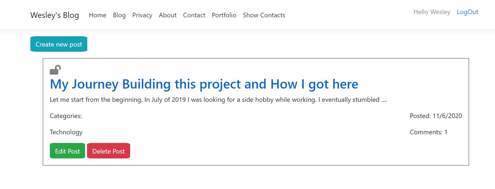
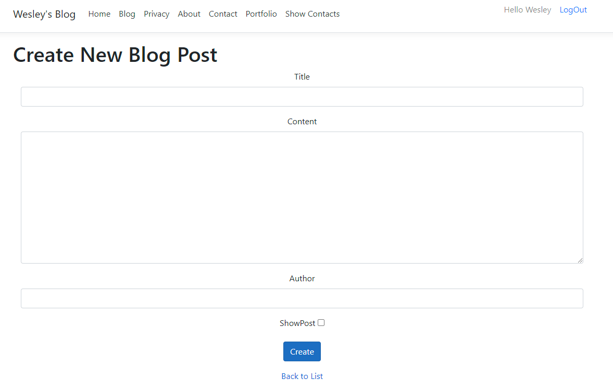
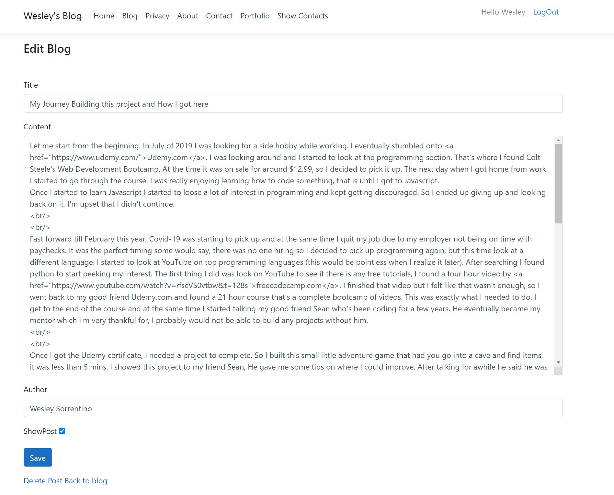
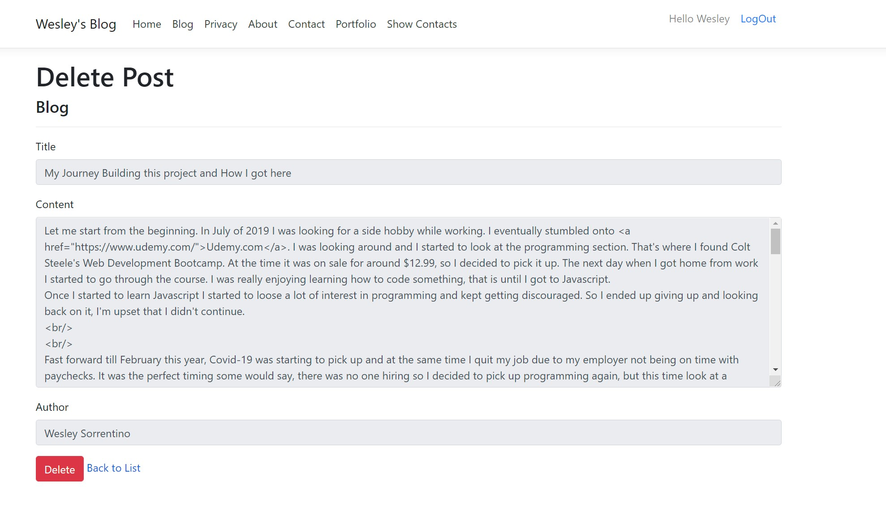

# This Project is no longer being updated due to newer version of a blog being built
[See here for new repo](https://github.com/WesleySorrentino/TheBlogProject)

This project is built inside of a Docker container. The reason behind this is to be able to push it to heroku, 
because unfortunately heroku doesn't support IIS Express application as of writing this.
[Click here to view project site.](https://wesleysblog.herokuapp.com/)

## How the Backend looks

### Blog Index page

### Blog Create Page

### Blog Edit Page

### Blog Delete Page

## Technologies used:

#### Dapper

Since I didn't know anything about asp.net, and wanted to challenge myself. I learned Dapper instead of using Entity Framework.
Every tutorial was using Entity Framework which would work fine for this project, but I found some speed tests showing Dapper being faster.

#### Authorization and Authentication

I was originally planning on building a User table in my PostgreSQL database and then learn about dealing with passwords. 
Instead I used the ASP.NET's built in Identity System, which saved on a lot of headaches.
I did however had to use Entity framework to migrate the columns to my PostgreSQL database.
